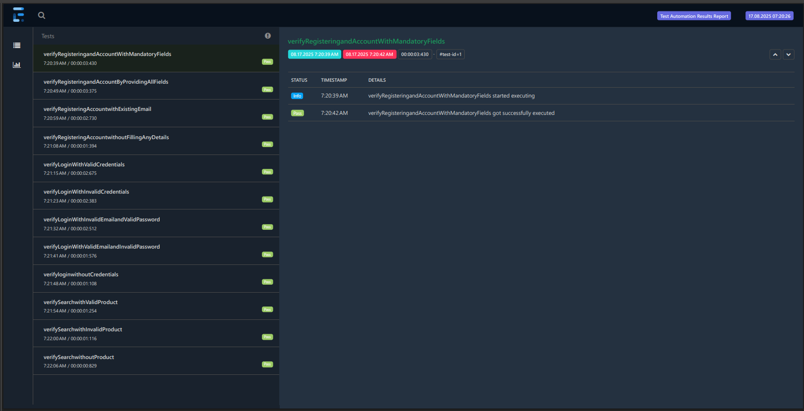
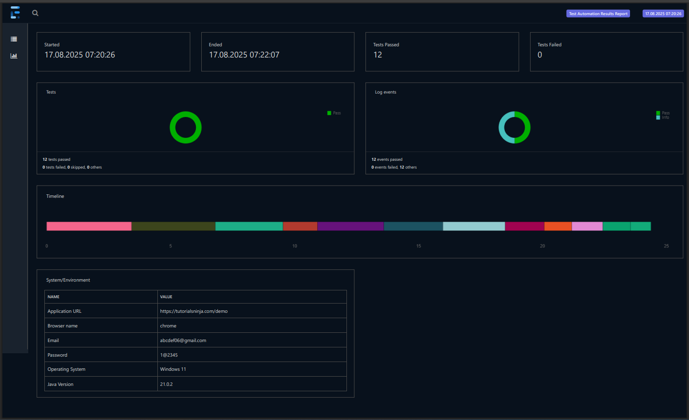

# 🚀 Selenium Automation Framework (Java + TestNG + Maven)

This repository contains a Selenium Automation Testing Framework built using **Java**, **TestNG**, **Maven**, and **Page Object Model (POM)** with **Page Factory** design pattern.

The framework is designed for reusability, maintainability, and scalability, making it easier to automate web applications with well-structured test cases and detailed reports.

--- 

##  📂 Project structure
```
selenium-automation/
│
├── src/main/java
│   └── com.automation.pages/         # Page classes (POM + Page Factory)
│       ├── AccountPage.java
│       ├── AccountSuccessPage.java
│       ├── HomePage.java
│       ├── LoginPage.java
│       ├── RegisterPage.java
│       ├── SearchPage.java
│
│   └── com.automation.config/        # Configuration files
│       └── config.properties
│
│   └── com.automation.listeners/     # TestNG Listeners
│       └── MyListeners.java
│
│   └── com.automation.testdata/      # Test Data
│       └── testdata.properties
│
│   └── com.automation.utils/         # Utility classes
│       ├── ExtentReporter.java
│       └── Utilities.java
│
├── src/test/java
│   └── com.automation.base/          # Base Test setup
│       └── Base.java
│
│   └── com.automation.tests/         # Test classes
│       ├── LoginTest.java
│       ├── RegisterTest.java
│       └── SearchTest.java
│
├── src/test/resources
│   └── testng.xml                    # TestNG Suite configuration
│
├── test-output/                      # Generated reports after execution
│   └── ExtentReports/
│       └── extentReport.html
│
└── pom.xml                           # Maven dependencies and plugins
```
---

## 📖 Project Structure

**_src/main/java folder_** has the following packages:

1. **com.automation.pages**
   - Pages are created using Page Object Model (POM) and Page Factory (@FindBy)
   - Contains all page classes with locators and reusable actions

2. **com.automation.config**
   - Contains config.properties file with valid details like:
      - Base URL
      - browser to be used
      - Email
      - Password
    
3. **com.automation.listeners**
   - Implements TestNG Listeners (ITestListener) in MyListeners.java.
   - Handles events such as onStart, onTestStart, onTestSuccess, onTestFailure, onTestSkipped, onFinish.

4. **com.automation.testdata**
   - Contains testdata.properties file with dynamic test data used in multiple test cases for input and as well as for assertion fields
    
5. **com.automation.utils**
   - ExtentReporter.java defines what fields the extent report contains. Spark Reporter used for this framework
   - Utilities.java contains implicit, explicit and page wait timeouts

**_src/test/java_** folder has the following packages:

1. **com.automation.base**
   - Base class defines initialization of Webdriver, loading of config and test data properties and opens browser and navigates to url
     
2. **com.automation.tests**
   - Contains actual TestNG tests with different test cases:
      - LoginTest contains:
          - TC1: valid username and password
          - TC2: valid username and invalid password
          - TC3: invalid username and invalid password
          - TC4: invalid username and invalid password
          - TC5: no username and password
            
      - RegisterTest contains:
          - TC1: registering with all fields filled with out subscribing to news letter 
          - TC2: registering with all fields filled with subscribing to news letter
          - TC3: registering account with existing email
          - TC4: registering without filling any details
            
      - SearchTest contains:
          - TC1: search with a valid product
          - TC2: search with invalid product
          - TC3: search with no product
        
   - Each Test class has:
       - @BeforeMethod (setup)
       - @Test methods (test execution using POM)
       - @AfterMethod (teardown)
        
  **_src/test/resources_** folder contains testng.xml that defines test suite, test groups and order of execution of the tests
  
  **pom.xml** contains maven dependencies for:
  ```
- selenium webdriver
- TestNG
- ExtentReports
- Maven Surefire plugin
 ```     
---

## ⚡ How to run the tests
Option 1: Run via Maven, go to the local folder where the project is stored and open cmd and enter:
```
mvn test
```

Option 2: Run via TestNG Suite (IDE)
```
Right-click on testng.xml → Run As → TestNG Suite
```
---

## 📊 Reports

Open after execution:

```
test-output/ExtentReports/extentReport.html
```
screenshots of the report:



--- 

## ✅ Features

  - Page Object Model (POM) with Page Factory
  - Config-driven (URL, credentials, test data)
  - TestNG Listeners for logging
  - Extent Reports for detailed reporting
  - Easy execution via Maven or TestNG Suite

--- 

## 🛠 Tech Stack

  - Java
  - Selenium WebDriver
  - TestNG
  - Maven
  - Extent Reports
  - Design Pattern: Page Object Model (Page Factory)

---

## 🎯 Execution Flow

  - TestNG suite (testng.xml) triggers execution.
  - Base.java initializes WebDriver & loads configs.
  - Test classes use page objects to perform actions.
  - Listeners log execution events.
  - Extent Report is generated with results.

            


